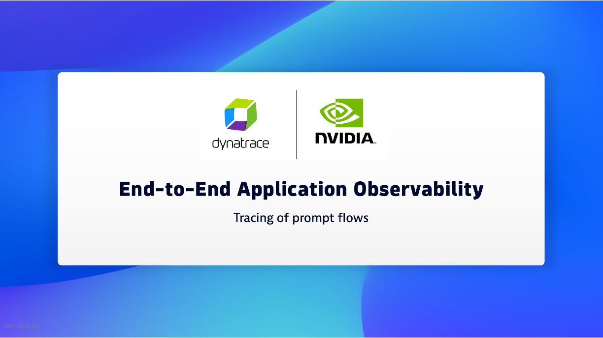

## AI Observability with OpenTelemetry

The OpenTelemetry project has defined [semantic conversions](https://opentelemetry.io/docs/specs/semconv/gen-ai/) for LLM spans, metrics, and events.  Setting up full stack observability for your GenAI applications is possible with Traceloop's OpenLLMetry, with OpenTelemetry under the hood, which can seamlessly provide comprehensive end-to-end insights into your production environments.

## What is OpenLLMetry?

[OpenLLMetry](https://www.traceloop.com/docs/openllmetry/introduction) is an opensource project that allows you to easily start monitoring and debugging the execution of your LLM app. Tracing is done in a non-intrusive way, built on top of OpenTelemetry.Once a application is instrumented with OpenLLMetry and configured with a Dynatrace OTLP API and token, the application automatically sends the spans and data to Dynatrace.

## Overview YouTube Video

## OpenTelemetry ingest into Dynatrace 

Below is a guide for how to configure OpenTelemetry ingest and analysis within Dynatrace. For more details on the use cases see the [Dynatrace AI Observability Hub tile](https://www.dynatrace.com/hub/detail/ai-and-llm-observability)

There are a few options to integrate [OpenTelemetry into Dynatrace](https://www.dynatrace.com/hub/detail/opentelemetry), but this guide is based on configuring an OpenLLMetry instrumented application with the [Dynatrace OTLP ingest APIs](https://docs.dynatrace.com/docs/discover-dynatrace/references/dynatrace-api/environment-api/opentelemetry).

## Sample Application 

The sample application is written in Python and can be found in this repo 

https://github.com/robertjahn/nim-example  

The application provides a single page search page that invokes the chat endpoint of the NIM microservice. 