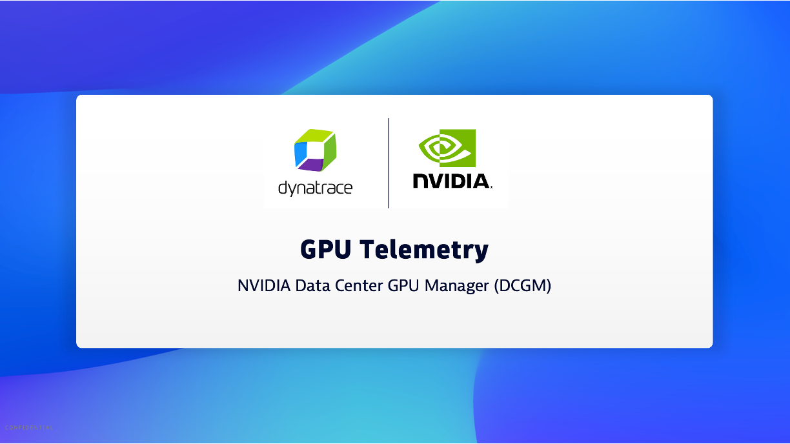

## What is the NVIDIA DCGM-Exporter

[DCGM-Exporter](https://docs.nvidia.com/datacenter/cloud-native/gpu-telemetry/latest/dcgm-exporter.html) is a tool based on the Go APIs to NVIDIA DCGM that allows users to gather GPU metrics and understand workload behavior or monitor GPUs in clusters. DCGM Exporter is written in Go and exposes GPU metrics at an HTTP endpoint (/metrics) for monitoring solutions. 

## Overview YouTube Video

This video shows what the metrics look like within Dynatrace using the Prometheus in Kubernetes ingest approach.

[](https://www.youtube.com/watch?v=8OaF3SXOCYE)

[YouTube Video](https://www.youtube.com/watch?v=8OaF3SXOCYE)


## DCGM Metric ingest into Dynatrace 

Below is a guide for how to configure metrics scraping from the NVIDIA DCGM-Exporter for ingest and analysis within Dynatrace.  For more details on the use cases see the [Dynatrace NVIDIA DCGM-Exporter Hub tile](https://www.dynatrace.com/hub/detail/nvidia-dcgm-exporter/?query=nvidi&filter=all)

There are a [few options to ingest Prometheus metrics into Dynatrace](https://docs.dynatrace.com/docs/ingest-from/extend-dynatrace/extend-metrics/ingestion-methods/prometheus) such as:
1. [Prometheus via OpenTelemetry Collector](https://docs.dynatrace.com/docs/ingest-from/opentelemetry/collector/use-cases/prometheus). This scripts the DCGM metrics from the DCGM exporter container endpoint.
1. [Prometheus in Kubernetes](https://docs.dynatrace.com/docs/ingest-from/setup-on-k8s/deployment). Within the Dynatrace K8s solution, there is a Dynatrace Activegate which performs the actual metric scraping.
1. Prometheus outside of Kubernetes using [Dynatrace Prometheus Extension](https://docs.dynatrace.com/docs/ingest-from/extensions/develop-your-extensions/data-sources/prometheus-extensions)

Below are guides for OpenTelemetry Collector and in Kubernetes approaches

# Prometheus via OpenTelemetry Collector

### Step 1 - Create API Token

The OpenTelemetry Collector will export data to the [Dynatrace OTLP API](https://docs.dynatrace.com/docs/ingest-from/opentelemetry/otlp-api)

You can just make one Dynatrace API Token with these scopes from the `Access Tokens` page within Dynatrace.  Save the token to a safe place.
* `metrics.ingest`

### Step 2 - Create OpenTelemetry Collector Config

Make copy of [dcgm/otelcol-config.yaml](dcgm/otelcol-config.yaml).  You can adjust this, but it has the config for scraping just metrics and sending them to the the Dynatrace OpenTelemetry Collector Config.

### Step 3 - Start OpenTelemetry Collector

This assumes the endpoint for dcgm-host is reachable by the Docker.

First set the environment variables used by Docker:

```
# adjust the host IP running dcgm-host
export DCGM_HOST=10.104.213.9

# adjust the post running dcgm-host
export DCGM_PORT=9400

# adjust to your environment
export DT_BASE_URL=https://jde30943.live.dynatrace.com

# adjust with your API Key
export DT_API_TOKEN=dt0c01.ABC123.ABC123
```

Run Docker:

```
docker run \
    -e DCGM_TARGET=dcgm-host:$DCGM_PORT   \
    -e DT_BASE_URL=$DT_BASE_URL   \
    -e DT_API_TOKEN=$DT_API_TOKEN   \
    -v "${PWD}/otelcol-config.yaml":/etc/otelcol/config.yaml   \
    --add-host "dcgm-host:$DCGM_HOST"   \
    otel/opentelemetry-collector-contrib --config /etc/otelcol/config.yaml
```

### Step 4 - Validate and add Dashboard

Refer to steps lower in this guide.

# Prometheus in Kubernetes

### Step 1 - Prerequisites

Within Dynatrace, complete the [Prerequisites](https://docs.dynatrace.com/docs/shortlink/monitor-prometheus-metrics#prerequisites) in your K8s settings by enabling these settings as shown below:
* Monitor Kubernetes namespaces, services, workloads, and pods
* Monitor annotated Prometheus exporters


### Step 2 - Annotate Pods

Run these commands to set the Dynatrace annotations as described [in the Dynatrace Documentation](https://docs.dynatrace.com/docs/observe/infrastructure-monitoring/container-platform-monitoring/kubernetes-monitoring/monitor-prometheus-metrics#annotate-prometheus-exporter-pods)

```
# verify pods present 
kubectl -n nvidia-gpu-operator get pods --selector=app=nvidia-dcgm-exporter 

# annotate pods
kubectl -n nvidia-gpu-operator annotate pods metrics.dynatrace.com/port=9400 --selector=app=nvidia-dcgm-exporter  
kubectl -n nvidia-gpu-operator annotate pods metrics.dynatrace.com/scrape=true --selector=app=nvidia-dcgm-exporter 

# verify
kubectl -n nvidia-gpu-operator describe pods --selector=nvidia-dcgm-exporter | grep dynatrace 
```
### Step 3 - Validate and add Dashboard

Refer to steps lower in this guide.

# Validate

Metrics will have a `DCGM` prefix.  Refer to [dcgm-exporter](https://github.com/NVIDIA/dcgm-exporter) repo for metrics names.

You can validate and analyze metrics with Dynatrace notebook as shown below:


# Add a Dashboard

Review metrics in Dynatrace dashboard.  Just download the [dcgm/NVIDIA-DCGM-dashboard.json](dcgm/NVIDIA-DCGM-dashboard.json) dashbaord from this repo and upload this example into your environmment on the dashboard page.


 
