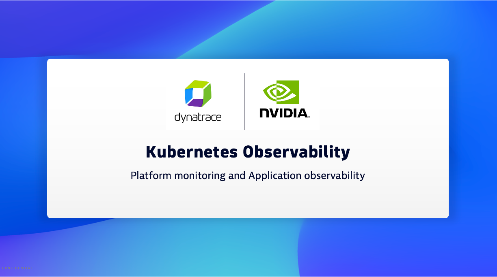

## Dynatrace Kubernetes Solution Overiew

Dynatrace provides a flexible approach to Kubernetes observability where you can pick and choose the level of observability you need for your Kubernetes clusters. 

## Overview YouTube Video

[YouTube Video](https://www.youtube.com/watch?v=ZYYr2VRXukI)

## Setup

[Review the Dynatrace documentation](https://docs.dynatrace.com/docs/ingest-from/setup-on-k8s/deployment) for an overview and guided path on the recommended options to cover your Kubernetes observability needs.  

The demo video used the `Kubernetes platform monitoring + Application observability` deployment option.