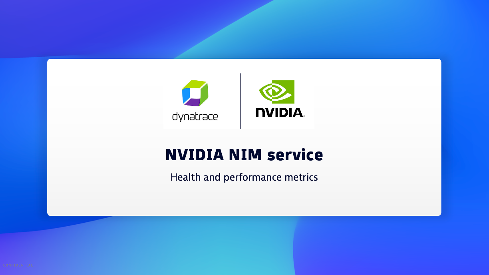

## NVIDIA NIM

[NIM provides Prometheus metrics](https://docs.nvidia.com/nim-operator/latest/observability.html) indicating request statistics at an HTTP endpoint (/metrics) for monitoring solutions. 

Below is a guide for how to configure metrics scraping from the NVIDIA NIM for ingest and analysis within Dynatrace. 

For more details on the use cases see the [Dynatrace NVIDIA NIM Hub tile](https://www.dynatrace.com/hub/detail/nvidia-nim/?query=nim&filter=all)

## Overview YouTube Video

[](https://www.youtube.com/watch?v=PhpN6sWo2pM)

## Example NIM model Deployment 

Below shows the deployment and valdiation of the [llama-3_3-70b-instruct model](https://build.nvidia.com/meta/llama-3_3-70b-instruct/deploy?environment=openshift.md) NIM using the OpenShift deployment option.   

### Step 1 - Prerequisites

A NVIDIA API Key that you generate within your provile within the [NVIDIA Developer Build portal](https://build.nvidia.com).  Key will have format of `nvapi-xxxxxx`

### Step 2 - Deploy

Adjust and run these OpenShift CLI commands:
* `NGC_API_KEY=nvapi-xxxxxx` value to match your token
* namespace name `nim-service`, if required for your setup

```
oc create ns nim-service

oc create secret -n nim-service docker-registry ngc-secret --docker-server=nvcr.io --docker-username='$oauthtoken' --docker-password=nvapi-xxxxxx 

oc create secret -n nim-service generic ngc-api-secret --from-literal=NGC_API_KEY=nvapi-xxxxxx 
```

### Step 3 -  Test NIM

First get into a pod to run curl commands:

```
oc run --rm -it -n default curl --image=curlimages/curl:latest -- ash 
```

Within the Pod with Curl, invoke the model 

```
curl -X POST http://llama-33-70b-instruct.nim-service:8000/v1/chat/completions -H 'Accept: application/json' -H 'Content-Type: application/json' -d '{"model": "meta/llama-3.3-70b-instruct","messages": [{"content":"What should I do for a 4 day vacation at Cape Hatteras National Seashore?","role": "user"}],"top_p": 1,"n": 1,"max_tokens": 1024,"stream": false, "frequency_penalty": 0.0,"stop": ["STOP"]}' 
```

Within the Pod with Curl, view metrics

```
curl -v -X GET http://llama-33-70b-instruct.nim-service:8000/v1/metrics 
```

Reattach to pod if needed 

```
oc attach -it curl 
```

## Metric ingest into Dynatrace

There are a few options to ingest Prometheus metrics into Dynatrace such as [Scrape data from an OpenTelemetry Collector](https://docs.dynatrace.com/docs/ingest-from/opentelemetry/collector/use-cases/prometheus), but this guide is based on a configuration of the DCGM running within a K8s instance that is also running the [Dynatrace K8s solution](https://docs.dynatrace.com/docs/ingest-from/setup-on-k8s/deployment). Within the Dynatrace K8s solution, there is a Dynatrace Activegate which performs the actual metric scraping.

### Step 1 - Prerequisites

Within Dynatrace, complete the [Prerequisites](https://docs.dynatrace.com/docs/shortlink/monitor-prometheus-metrics#prerequisites) in your K8s settings by enabling these settings as shown below:
* Monitor Kubernetes namespaces, services, workloads, and pods
* Monitor annotated Prometheus exporters


### Step 2 - Annotate Pods

Run these commands to set the Dynatrace annotations as described [in the Dynatrace Documentation](https://docs.dynatrace.com/docs/observe/infrastructure-monitoring/container-platform-monitoring/kubernetes-monitoring/monitor-prometheus-metrics#annotate-prometheus-exporter-pods)

The NIM model in our example, `llama-33-70b-instruct`, has metric on the `/v1/metrics` endpoint 

```
# verify pods present 
kubectl -n nim-service get pods --selector=app=llama-33-70b-instruct  

# annotate pods
kubectl -n nim-service annotate pods metrics.dynatrace.com/port=8000 --selector=app=llama-33-70b-instruct 
kubectl -n nim-service annotate pods metrics.dynatrace.com/scrape=true --selector=app=llama-33-70b-instruct 
kubectl -n nim-service annotate pods metrics.dynatrace.com/path=/v1/metrics --selector=app=llama-33-70b-instruct 

# verify
kubectl -n nvidia-gpu-operator describe pods --selector=app=llama-33-70b-instruct | grep dynatrace 
```

### Step 3 - Validate

Refer to the [NVIDIA NIM documentation](https://docs.nvidia.com/nim-operator/latest/observability.html) for metrics names.

You can validate and analyze metrics with Dynatrace notebook as shown below:


### Step 4 - Add a Dashboard

Review metrics in Dynatrace dashboard.


[An example Dashboard](https://dqr03366.apps.dynatrace.com/ui/apps/dynatrace.dashboards/dashboard/ad1b5ffa-f09d-4360-9daf-f48b3fb513e53) can be found in the Dynatrace Playground.
