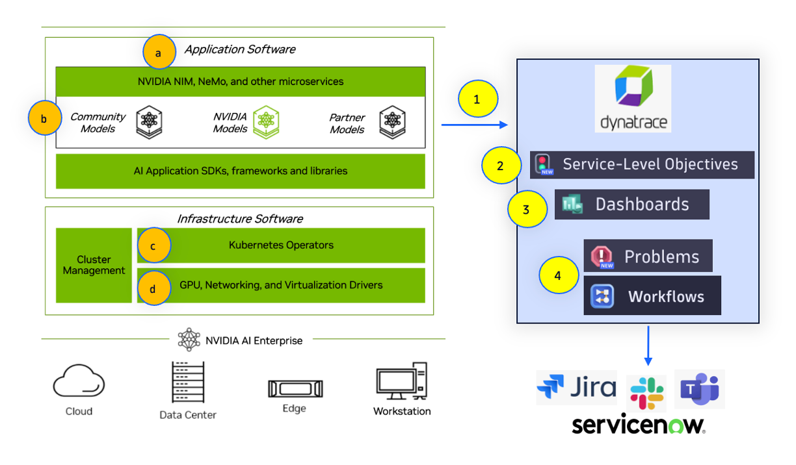

# Overview

This repo provides various guides to show how easy it is to setup and monitor the key tiers and components of the [NVIDIA enterprise stack](https://docs.nvidia.com/ai-enterprise), LLMs, and Generative AI applications with [Dynatrace](https://www.dynatrace.com). Guides are structured according the visual shown above.

## Dynatrace and NVIDIA

The Dynatrace platform brings both complete observability to and automation for various tiers in AI application stacks. Below are guides to setup the Dynatrace observability and once enabled, they bring:
1. End-to-End Application Observability
2. Dynatrace Service Level Management (SLOs) to manage performance, safety, and costs.
3. Custom views and analytics using dashboards and notebooks
4. Dynatrace workflows raise SLO violations and problems next actions (e.g. Slack or MS Teams) or Incident Management (e.g. ServiceNow & Jira)

## Setup Guides

### A. End-to-End Application Observability 

[Dynatrace AI Observability](https://www.dynatrace.com/hub/detail/ai-and-llm-observability/?filter=ai-ml-observability) brings End-to-End visibility to user interactions, prompt flows, and AI/LLM model performance of your Generative AI, agentic, and LLM services.

* [AI-observability](AI-observability.md) setup guide

### B. NVIDIA NIM, NeMo and technologies

Expanded observability coverage of exposed Prometheus metrics and OpenTelemetry telemetry from the various NVIDIA generative AI and lifecycle management tools and technologies. 

1. [NVIDIA NIM](https://developer.nvidia.com/nim) is a set of easy-to-use microservices designed to accelerate the deployment of generative AI models across any cloud or data center. 
    * [Setup guide for Dynatrace Observability and NVIDIA NIM](NIM.md)
2. [NVIDIA NeMo Agent toolkit](https://github.com/NVIDIA/NeMo-Agent-Toolkit) is a flexible, lightweight, and unifying library that allows you to easily connect existing enterprise agents to data sources and tools across any framework.  The NeMo Agent toolkit uses a flexible, plugin-based observability system that provides comprehensive support for configuring logging, tracing, and metrics for workflows. 
    * [Setup guide for Dynatrace Observability and NeMo toolkit agents using OpenTelemetry](TOOLKIT.md)

### C. Kubernetes

Real-time auto-discovery and analysis of applications, NVIDIA platform components, and infrastructure.

* [Setup guide for Dynatrace Observability and Kubernetes](K8s.md)

### D. GPU telemetry

Understand workload behavior or monitor GPUs in clusters

  * [Setup guide for Dynatrace Observability and DCGM-Exporter](DCGM-exporter.md)

