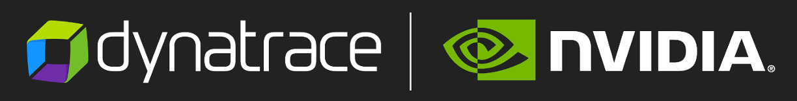
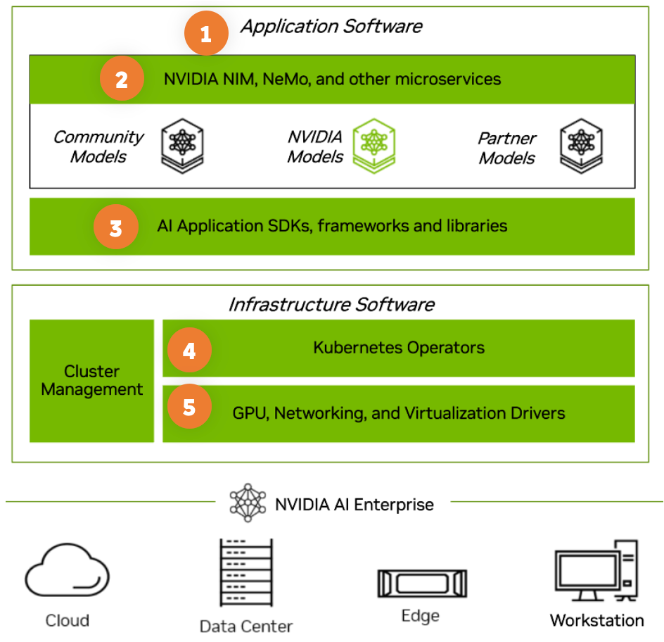

# Overview

NVIDIA is helping enterprises build AI factories that are cost effective, scalable and high-performing — equipping them to meet the next industrial revolution. The design for an [Enterprise AI Factory](https://www.nvidia.com/en-us/solutions/ai-factories/validated-design/) integrates seamlessly with enterprise systems, data sources, and security infrastructure through NVIDIA’s partner solutions.

As described in the [NVIDIA Enterprise AI Factory - Design Guide](https://docs.nvidia.com/ai-enterprise/planning-resource/ai-factory-white-paper/latest/ecosystem-architecture.html), it is with Observability that teams can understand the operation of long-running agents, extensive telemetry is necessary to observe the internal reasoning of the system. AgentOps addresses this requirement through a three-pronged monitoring strategy: traces detailing the workflow, logging user activity and responses of the models, and key performance metrics for the outcomes. This comprehensive set of signals provides a complete view, illustrating the entire execution path and quantifying the business value derived from these long-duration tasks.

The [NVIDIA AI Enterprise](https://docs.nvidia.com/ai-enterprise/deployment/bare-metal/latest/platform-overview.html) Infrastructure software encompasses all necessary components for managing and optimizing infrastructure along with AI workloads. NVIDIA provides Release Branches to meet organizational needs. The NVIDIA Kubernetes Operators facilitate a standardized management of NVIDIA GPUs, AI models, and network resources within Kubernetes environments as well as standalone Docker on Red Hat Enterprise Linux, SUSE Linux Enterprise Server, and Ubuntu.

As a NVIDIA validated partner, Dynatrace serves as a critial part of AI factorys by bringing end-to-end and full stack observability for LLMs and Agentic Generative AI applications running on NVIDIA GPUs and [NVIDIA AI Enterprise](https://www.nvidia.com/en-us/data-center/products/ai-enterprise/) that brings together microservices, frameworks, and libraries for AI development with advanced GPU orchestration and infrastructure management in a fully supported, production-ready, commercial software suite. 

# How to get started

This repo provides various guides to show how easy it is to setup and monitor the key tiers and components of the [NVIDIA enterprise stack](https://docs.nvidia.com/ai-enterprise), LLMs, and Generative AI applications with [Dynatrace](https://www.dynatrace.com). Guides are structured according the visual shown below.

1. [End-to-End Application Observability](ai-observability/README.md)
1. [NVIDIA NIM, NeMo and other microsevices](microservices/README.md)
1. [AI application SDKs, frameworks and libraries](frameworks/README.md)
1. [Kubernetes](kubernetes/README.md)
1. [GPU telemetry](gpu/README.md)

> **Note**
> These guides are not officially supported by Dynatrace, but the integrations themselves are.

