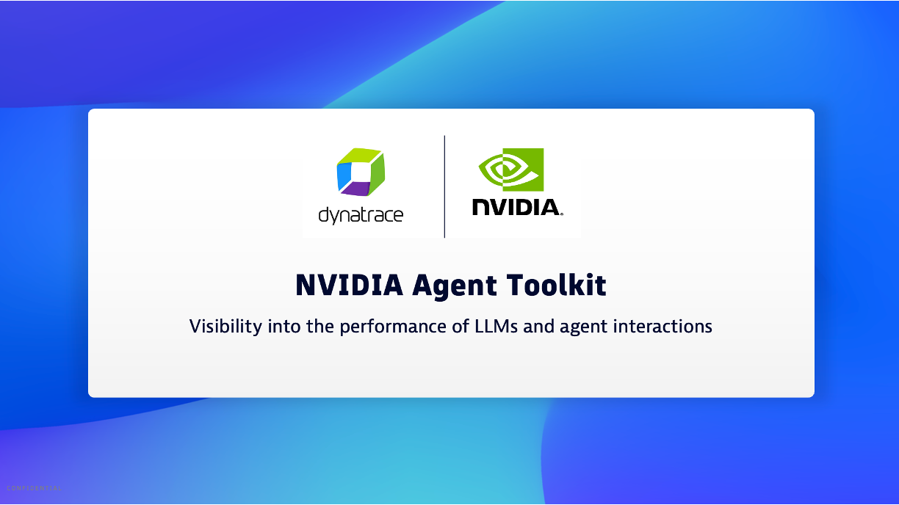

## NVIDIA NeMo Agent toolkit

Refer to the [NVIDIA guide](https://github.com/NVIDIA/NeMo-Agent-Toolkit/blob/develop/docs/source/workflows/observe/observe-workflow-with-dynatrace.md)  for now stream OpenTelemetry (OTel) traces from your NVIDIA NeMo Agent toolkit workflows to the OpenTelemetry Protocol (OTLP) ingest API, which in turn provides the ability to have full visibility into the performance of LLMs and agent interactions​.

## Overview YouTube Video

