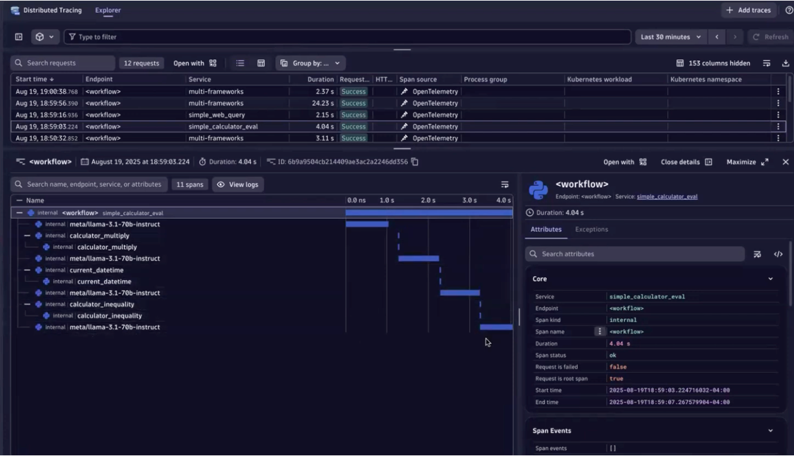

## NVIDIA NeMo Agent toolkit

[NVIDIA NAT (NeMo Agent toolkit)](https://github.com/NVIDIA/NeMo-Agent-Toolkit) is a flexible, lightweight, and unifying library that allows you to easily connect existing enterprise agents to data sources and tools across any framework.  It focuses on enabling developers to quickly build, evaluate, profile, and accelerate complex agentic AI workflows — systems in which multiple AI agents collaborate to perform tasks. 

The NeMo Agent toolkit uses a flexible, plugin-based [observability](https://docs.nvidia.com/nemo/agent-toolkit/1.5/run-workflows/observe/observe.html) system that provides comprehensive support for configuring logging, tracing, and metrics for workflows. 

# Observability 

Using OpenTelemetry, traces and logs streamed from your NVIDIA NeMo Agent toolkit workflows to Dynatrace provides the ability to have full visibility into the performance of LLMs and agent interactions​.

### Video

Below is a [YouTube Video](https://www.youtube.com/watch?v=2FAS8T9qVEc) for what to expect once configured. 

### Distributed traces

# How to get started

Refer to the [Observing with Dynatrace NAT guide](https://github.com/NVIDIA/NeMo-Agent-Toolkit/blob/main/docs/source/run-workflows/observe/observe-workflow-with-dynatrace.md) with the NeMo-Agent-Toolkit GitHub repo.

