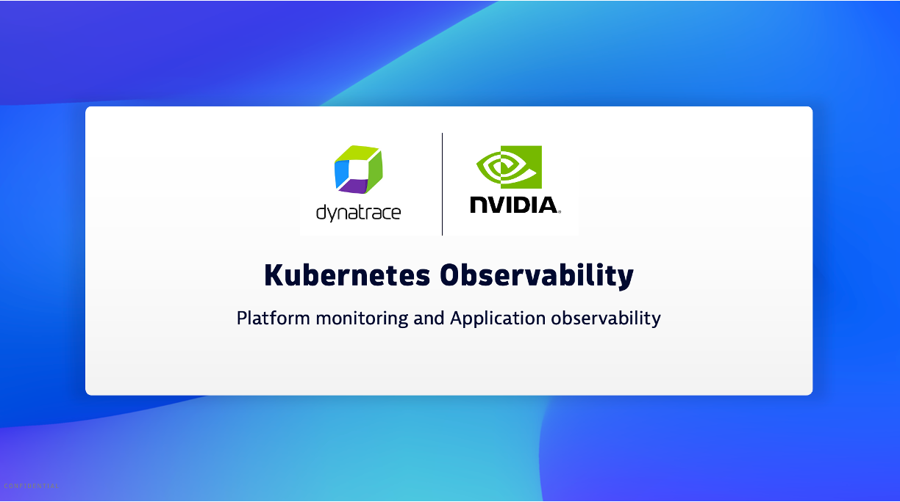
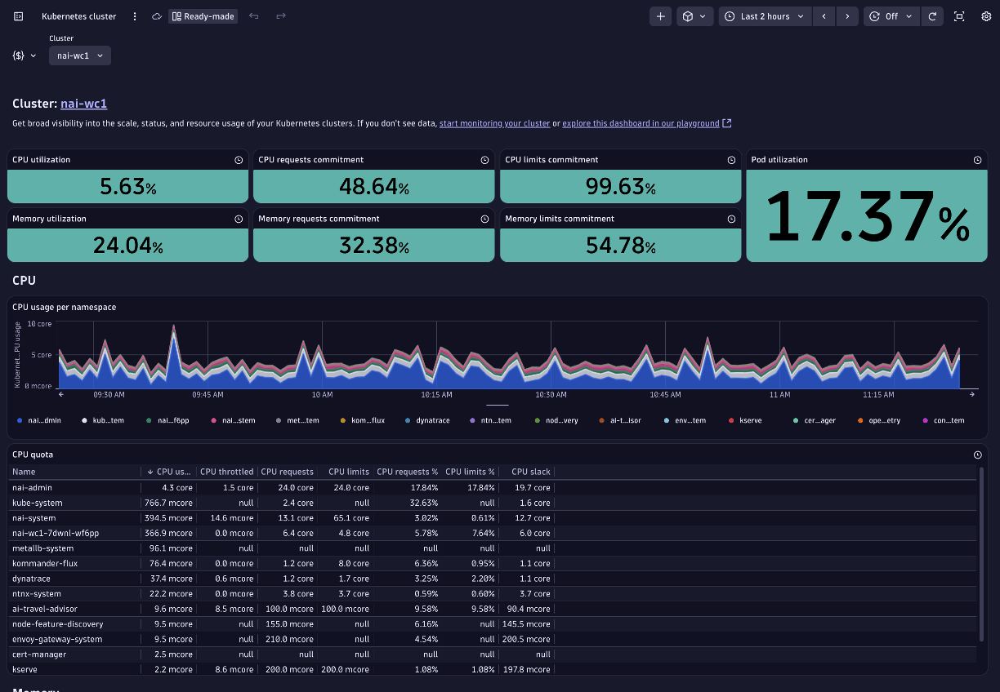
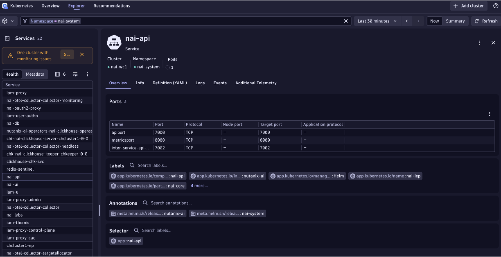
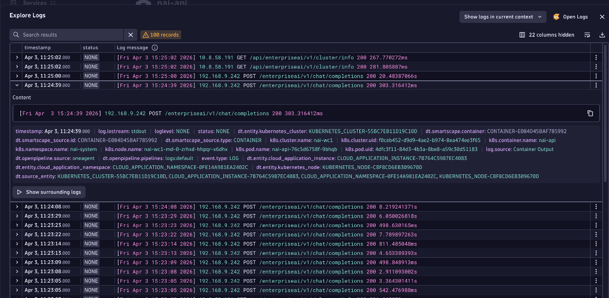
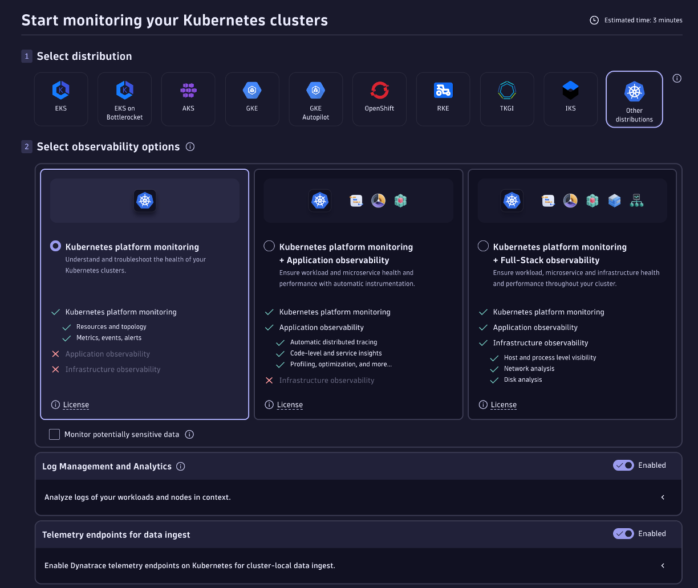

# NVIDIA AI Enterprise and Kubernetes

[NVIDIA AI Enterprise](https://docs.nvidia.com/ai-enterprise/deployment/bare-metal/latest/platform-overview.html) can be deployed with Kubernetes using supported distributions that include Nutanix Kubernetes Platform (NKP), Red Hat OpenShift, VMware Tanzu Platform, and Upstream Kubernetes.  Using Kubernetes as the infrastructure layer enables the use of various components that ensure efficient deployment, management, and scaling of AI applications.

Dynatrace has [technology partnerships and support](https://www.dynatrace.com/hub/?query=kubernetes) of multiple Kubernetes platforms certified wity NVIDIA AI Enterprise and provides a flexible approach to Kubernetes observability where you can pick and choose the level of observability you need for your Kubernetes clusters and supports the top Kubernetes distributions.

# Observability

The [Dynatrace Kubernetes Solution](https://www.dynatrace.com/hub/detail/kubernetes-1) is an all-in-one Kubernetes observability for K8s infrastructure and apps teams.  It delivers platform monitoring and application observability with real-time auto-discovery and analysis of applications, platform components, and cloud infrastructure without requiring any code changes.

Below is a video and some screenshots for what to expect once configured. 

### Video

This [YouTube Video](https://www.youtube.com/watch?v=ZYYr2VRXukI) shows a monitored Kubernetes cluster within Dynatrace.

### Kubernetes App 

### Kubernetes Dashboard

### The Example service

### The Example service log

# How to get started

> **Note**
> This guide is not officially supported by Dynatrace, but the integrations themselves are.

An easy way to get started is to simply choose the `Add cluster` within the Kubernetes App and selecting the [Platform montoring](https://docs.dynatrace.com/docs/ingest-from/setup-on-k8s/deployment/platform-observability ) option. The configuration page will guide how to create an API token and use of Helm deployment for the operator and using the `kubectl apply` command to deploy the `dynakube` resource that defines the Dynatrace environment and other settings.

[Review the Dynatrace documentation](https://docs.dynatrace.com/docs/ingest-from/setup-on-k8s/deployment) for an overview and guided path on the recommended options to cover your Kubernetes observability needs.

Below is a screenshots of the `Add cluster` page.

