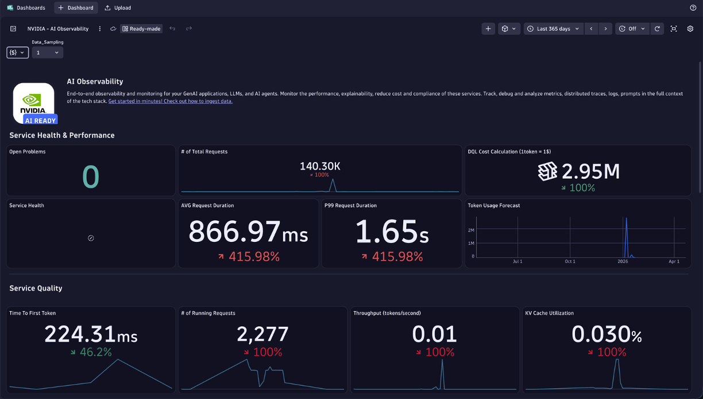

# NVIDIA NIM

[NVIDIA NIM](https://www.nvidia.com/en-us/ai-data-science/products/nim-microservices) provides prebuilt, optimized inference microservices for rapidly deploying the latest AI models on any NVIDIA-accelerated infrastructure—cloud, data center, workstation, and edge.

# Observability

[NIM microservices provide Prometheus metrics](https://docs.nvidia.com/nim-operator/latest/observability.html) indicating request statistics at an HTTP `/metrics` endpoint for monitoring solutions. 

Below is a video and screenshots for what to expect once configured. For more details on the use cases see the [Dynatrace NVIDIA NIM Hub tile](https://www.dynatrace.com/hub/detail/nvidia-nim) Hub tile.

### Video

This [YouTube Video](https://www.youtube.com/watch?v=PhpN6sWo2pM) shows a monitored Kubernetes cluster within Dynatrace.

### Example Dashboard

An example Dashboard can be found in the Dynatrace Playground within the [AI Observability App](https://dqr03366.apps.dynatrace.com/ui/apps/dynatrace.genai.observability/welcome).



# How to get started

There are a few options to ingest Prometheus metrics into Dynatrace such as [Scrape data from an OpenTelemetry Collector](https://docs.dynatrace.com/docs/ingest-from/opentelemetry/collector/use-cases/prometheus), but this guide is based on a configuration of the DCGM running within a K8s instance that is also running the [Dynatrace K8s solution](https://docs.dynatrace.com/docs/ingest-from/setup-on-k8s/deployment). Within the Dynatrace K8s solution, there is a Dynatrace Activegate which performs the actual metric scraping.

> **Note**
> This guide is not officially supported by Dynatrace, but the integrations themselves are.

### Step 1 - Prerequisites

Within Dynatrace, complete the [Prerequisites](https://docs.dynatrace.com/docs/shortlink/monitor-prometheus-metrics#prerequisites) in your K8s settings by enabling these settings as shown below:
* Monitor Kubernetes namespaces, services, workloads, and pods
* Monitor annotated Prometheus exporters


### Step 2 - Annotate Pods

Run these commands to set the Dynatrace annotations as described [in the Dynatrace Documentation](https://docs.dynatrace.com/docs/observe/infrastructure-monitoring/container-platform-monitoring/kubernetes-monitoring/monitor-prometheus-metrics#annotate-prometheus-exporter-pods)

The NIM model in our example, `llama-33-70b-instruct`, has metric on the `/v1/metrics` endpoint 

```
# verify pods present 
kubectl -n nim-service get pods --selector=app=llama-33-70b-instruct  

# annotate pods
kubectl -n nim-service annotate pods metrics.dynatrace.com/port=8000 --selector=app=llama-33-70b-instruct 
kubectl -n nim-service annotate pods metrics.dynatrace.com/scrape=true --selector=app=llama-33-70b-instruct 
kubectl -n nim-service annotate pods metrics.dynatrace.com/path=/v1/metrics --selector=app=llama-33-70b-instruct 

# verify
kubectl -n nvidia-gpu-operator describe pods --selector=app=llama-33-70b-instruct | grep dynatrace 
```

### Step 3 - Validate

Refer to the [NVIDIA NIM documentation](https://docs.nvidia.com/nim-operator/latest/observability.html) for metrics names.

You can validate and analyze metrics with Dynatrace notebook as shown below:


### Step 4 - Add a Dashboard

Review metrics in Dynatrace dashboard.


